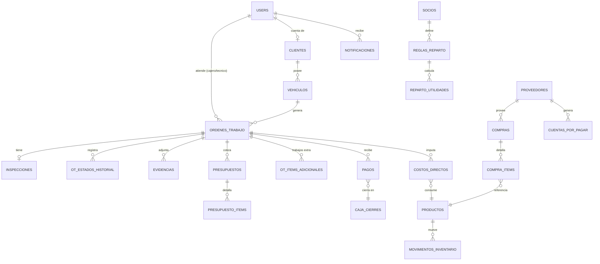

# Esquema de Base de Datos — Sistema Taller Automotriz

Motor: **PostgreSQL 16**. Convención: PK `id` (bigint, autoincrement/identity), timestamps
`created_at` / `updated_at` en todas las tablas (omitidos abajo por brevedad), borrado lógico
(`deleted_at`) en tablas de negocio críticas (clientes, vehículos, órdenes de trabajo).

## Diagrama entidad-relación (resumen)

---

## 1. Usuarios, roles y clientes

### `users`
| Columna | Tipo | Notas |
|---|---|---|
| id | bigint PK | |
| nombre | varchar(150) | |
| email | varchar(150) unique | nullable si login solo por WhatsApp |
| telefono_whatsapp | varchar(20) unique | usado para login rápido y notificaciones |
| password | varchar | nullable (si login es solo vía enlace WhatsApp o Google) |
| google_id | varchar(50) unique nullable | ID de cuenta de Google (`sub` del token), para login con Google vía Socialite |
| rol | enum(`super_admin`,`cajero`,`operador_tecnico`,`cliente`) | también se apoya en `roles`/`permissions` de spatie para permisos finos |
| activo | boolean default true | |
| ultimo_login_at | timestamp | |

### `socios`
| Columna | Tipo | Notas |
|---|---|---|
| id | bigint PK | |
| user_id | bigint FK → users | socio con acceso al sistema (super_admin) |
| nombre | varchar(150) | por si el socio no tiene user (ej. inversionista pasivo) |
| porcentaje_default | decimal(5,2) | % de reparto por defecto |
| activo | boolean | |

### `clientes`
| Columna | Tipo | Notas |
|---|---|---|
| id | bigint PK | |
| user_id | bigint FK → users, nullable | cuenta de portal, null si aún no se registró |
| nombre | varchar(150) | |
| ci_nit | varchar(20) | |
| telefono_whatsapp | varchar(20) | |
| correo | varchar(150) nullable | |
| direccion | varchar(255) nullable | |
| notas | text nullable | |
| deleted_at | timestamp nullable | |

### `vehiculos`
| Columna | Tipo | Notas |
|---|---|---|
| id | bigint PK | |
| cliente_id | bigint FK → clientes | |
| placa | varchar(15) | |
| marca | varchar(50) | |
| modelo | varchar(50) | |
| anio | smallint | |
| color | varchar(30) | |
| motor | varchar(50) nullable | |
| kilometraje_actual | integer | |
| deleted_at | timestamp nullable | |

---

## 2. Órdenes de Trabajo (Módulo 2)

### `ordenes_trabajo`
| Columna | Tipo | Notas |
|---|---|---|
| id | bigint PK | |
| codigo | varchar(20) unique | correlativo tipo `OT-2026-0001` |
| vehiculo_id | bigint FK → vehiculos | |
| cliente_id | bigint FK → clientes | denormalizado para queries rápidas |
| recibido_por_id | bigint FK → users | cajero u operador que recepciona |
| tecnico_asignado_id | bigint FK → users, nullable | mecánico asignado |
| estado | enum(`recepcionado`,`en_diagnostico`,`esperando_aprobacion`,`en_reparacion`,`control_calidad`,`listo_entrega`,`entregado`,`cancelado`) | estado Kanban |
| descripcion_problema | text | motivo de ingreso reportado por cliente |
| kilometraje_ingreso | integer | |
| nivel_gasolina | enum(`E`,`1/4`,`1/2`,`3/4`,`F`) | |
| fecha_ingreso | timestamp | |
| fecha_entrega_estimada | date nullable | |
| fecha_entrega_real | timestamp nullable | |
| deleted_at | timestamp nullable | |

### `ot_estados_historial`
Timeline auditable de cambios de estado (soporta la "línea de tiempo interactiva" del Módulo 5).
| Columna | Tipo | Notas |
|---|---|---|
| id | bigint PK | |
| orden_trabajo_id | bigint FK → ordenes_trabajo | |
| estado_anterior | varchar(30) nullable | |
| estado_nuevo | varchar(30) | |
| user_id | bigint FK → users | quien hizo el cambio |
| comentario | text nullable | |
| created_at | timestamp | |

### `inspecciones`
Recepción e inspección digital.
| Columna | Tipo | Notas |
|---|---|---|
| id | bigint PK | |
| orden_trabajo_id | bigint FK → ordenes_trabajo, unique | 1:1 |
| accesorios | jsonb | ej. `["llanta de auxilio","gato","radio"]` |
| rayones_previos | jsonb | lista de puntos/notas sobre daños previos, puede incluir coords sobre diagrama de auto |
| observaciones | text nullable | |
| firma_cliente_url | varchar(255) | imagen de firma capturada |
| firmado_at | timestamp nullable | |

### `evidencias`
Fotos/videos de piezas, repuestos, avance (Módulo 2 y soporte offline).
| Columna | Tipo | Notas |
|---|---|---|
| id | bigint PK | |
| uuid_cliente | uuid unique | generado en el dispositivo para upload idempotente offline |
| orden_trabajo_id | bigint FK → ordenes_trabajo | |
| subido_por_id | bigint FK → users | |
| tipo | enum(`foto`,`video`) | |
| url | varchar(255) | |
| etiqueta | varchar(100) nullable | ej. "pastillas de freno desgastadas" |
| tomada_at | timestamp | timestamp del dispositivo (puede diferir del upload si fue offline) |

---

## 3. Presupuestos y aprobaciones (Módulo 2 y 5)

### `presupuestos`
| Columna | Tipo | Notas |
|---|---|---|
| id | bigint PK | |
| orden_trabajo_id | bigint FK → ordenes_trabajo | |
| creado_por_id | bigint FK → users | |
| version | smallint default 1 | permite re-cotizar |
| estado | enum(`borrador`,`enviado`,`aprobado`,`rechazado`) | |
| subtotal | decimal(10,2) | |
| descuento | decimal(10,2) default 0 | |
| total | decimal(10,2) | |
| respondido_at | timestamp nullable | |
| respondido_por_id | bigint FK → users, nullable | cliente que aprobó/rechazó |

### `presupuesto_items`
| Columna | Tipo | Notas |
|---|---|---|
| id | bigint PK | |
| presupuesto_id | bigint FK → presupuestos | |
| tipo | enum(`repuesto`,`mano_obra`,`tercerizado`) | |
| producto_id | bigint FK → productos, nullable | si es repuesto de stock |
| descripcion | varchar(255) | |
| cantidad | decimal(8,2) | |
| precio_unitario | decimal(10,2) | |
| subtotal | decimal(10,2) | |
| es_adicional | boolean default false | true si surge durante diagnóstico (requiere aprobación aparte) |
| aprobado | boolean nullable | null = pendiente, true/false = respuesta del cliente |

---

## 4. Finanzas (Módulo 3)

### `pagos`
Ingresos: anticipos, pagos parciales/completos.
| Columna | Tipo | Notas |
|---|---|---|
| id | bigint PK | |
| orden_trabajo_id | bigint FK → ordenes_trabajo, nullable | nullable para pagos generales/deuda de cuenta |
| cliente_id | bigint FK → clientes | |
| cajero_id | bigint FK → users | |
| caja_cierre_id | bigint FK → caja_cierres, nullable | se asigna al cierre del día |
| tipo | enum(`anticipo`,`parcial`,`completo`,`abono_deuda`) | |
| metodo | enum(`efectivo`,`qr`,`tarjeta`) | |
| monto | decimal(10,2) | |
| referencia_externa | varchar(100) nullable | nro de operación QR/tarjeta |
| comprobante_url | varchar(255) nullable | recibo/factura PDF generado |
| fecha | timestamp | |

### `caja_cierres`
Cierre de caja diario por cajero.
| Columna | Tipo | Notas |
|---|---|---|
| id | bigint PK | |
| cajero_id | bigint FK → users | |
| fecha | date | |
| monto_apertura | decimal(10,2) | |
| monto_esperado | decimal(10,2) | calculado de pagos del día |
| monto_contado | decimal(10,2) | ingresado manualmente al cerrar |
| diferencia | decimal(10,2) | contado - esperado |
| estado | enum(`abierta`,`cerrada`) | |
| cerrado_at | timestamp nullable | |

### `costos_directos`
Costo real imputado a cada OT (repuestos + mano de obra + tercerizados) para margen neto.
| Columna | Tipo | Notas |
|---|---|---|
| id | bigint PK | |
| orden_trabajo_id | bigint FK → ordenes_trabajo | |
| tipo | enum(`repuesto`,`mano_obra`,`tercerizado`) | |
| producto_id | bigint FK → productos, nullable | |
| tecnico_id | bigint FK → users, nullable | para mano de obra / comisión |
| descripcion | varchar(255) | |
| cantidad | decimal(8,2) default 1 | |
| costo_unitario | decimal(10,2) | costo real (no precio de venta) |
| costo_total | decimal(10,2) | |

### `gastos_egresos`
Costos fijos/variables del taller (no ligados a una OT).
| Columna | Tipo | Notas |
|---|---|---|
| id | bigint PK | |
| categoria | enum(`fijo`,`variable`) | |
| concepto | varchar(150) | ej. "Alquiler", "Luz/Agua", "Insumos químicos", "Sueldos" |
| monto | decimal(10,2) | |
| registrado_por_id | bigint FK → users | |
| comprobante_url | varchar(255) nullable | |
| fecha | date | |

### `reglas_reparto`
Configuración de % de reparto de utilidades entre socios (Super Admin).
| Columna | Tipo | Notas |
|---|---|---|
| id | bigint PK | |
| socio_id | bigint FK → socios | |
| porcentaje | decimal(5,2) | debe sumar 100 entre todos los socios activos |
| vigente_desde | date | permite historial de cambios de acuerdo |
| vigente_hasta | date nullable | |

### `reparto_utilidades`
Cálculo periódico (ej. mensual) de utilidad neta y distribución.
| Columna | Tipo | Notas |
|---|---|---|
| id | bigint PK | |
| periodo_inicio | date | |
| periodo_fin | date | |
| ingresos_total | decimal(12,2) | |
| costos_directos_total | decimal(12,2) | |
| gastos_total | decimal(12,2) | |
| utilidad_neta | decimal(12,2) | |
| generado_por_id | bigint FK → users | |
| generado_at | timestamp | |

### `reparto_utilidad_detalle`
| Columna | Tipo | Notas |
|---|---|---|
| id | bigint PK | |
| reparto_utilidad_id | bigint FK → reparto_utilidades | |
| socio_id | bigint FK → socios | |
| porcentaje_aplicado | decimal(5,2) | |
| monto | decimal(12,2) | |

---

## 5. Inventario y Proveedores (Módulo 4)

### `productos`
Kardex de repuestos e insumos.
| Columna | Tipo | Notas |
|---|---|---|
| id | bigint PK | |
| sku | varchar(50) unique | |
| nombre | varchar(150) | |
| categoria | varchar(80) nullable | ej. "Aceites", "Filtros" |
| unidad_medida | varchar(20) | ej. "unidad", "litro" |
| stock_actual | decimal(10,2) default 0 | actualizado por trigger/observer en cada movimiento |
| stock_minimo | decimal(10,2) default 0 | dispara alerta |
| precio_compra_promedio | decimal(10,2) | |
| precio_venta | decimal(10,2) | |
| activo | boolean default true | |

### `movimientos_inventario`
| Columna | Tipo | Notas |
|---|---|---|
| id | bigint PK | |
| producto_id | bigint FK → productos | |
| tipo | enum(`entrada_compra`,`salida_ot`,`ajuste`,`devolucion`) | |
| cantidad | decimal(10,2) | positivo o negativo según tipo |
| referencia_id | bigint nullable | id de compra u OT relacionada (polimórfico simple) |
| referencia_tipo | varchar(50) nullable | `compra` \| `orden_trabajo` |
| user_id | bigint FK → users | |
| fecha | timestamp | |

### `proveedores`
| Columna | Tipo | Notas |
|---|---|---|
| id | bigint PK | |
| nombre | varchar(150) | |
| nit | varchar(20) nullable | |
| telefono | varchar(20) nullable | |
| direccion | varchar(255) nullable | |
| activo | boolean default true | |

### `compras`
| Columna | Tipo | Notas |
|---|---|---|
| id | bigint PK | |
| proveedor_id | bigint FK → proveedores | |
| registrado_por_id | bigint FK → users | |
| numero_factura | varchar(50) nullable | |
| total | decimal(10,2) | |
| estado_pago | enum(`pendiente`,`parcial`,`pagado`) | |
| fecha | date | |

### `compra_items`
| Columna | Tipo | Notas |
|---|---|---|
| id | bigint PK | |
| compra_id | bigint FK → compras | |
| producto_id | bigint FK → productos | |
| cantidad | decimal(10,2) | |
| precio_unitario | decimal(10,2) | |
| subtotal | decimal(10,2) | |

### `cuentas_por_pagar`
| Columna | Tipo | Notas |
|---|---|---|
| id | bigint PK | |
| proveedor_id | bigint FK → proveedores | |
| compra_id | bigint FK → compras | |
| monto_original | decimal(10,2) | |
| saldo_pendiente | decimal(10,2) | |
| fecha_vencimiento | date nullable | |
| estado | enum(`pendiente`,`pagado`,`vencido`) | |

---

## 6. Notificaciones y documentos

### `notificaciones`
Log de envíos WhatsApp/otros (Módulo 5 e integraciones).
| Columna | Tipo | Notas |
|---|---|---|
| id | bigint PK | |
| user_id | bigint FK → users, nullable | destinatario si tiene cuenta |
| telefono_destino | varchar(20) | |
| canal | enum(`whatsapp`,`email`) | |
| plantilla | varchar(80) | ej. `ot_en_diagnostico`, `ot_lista_entrega` |
| orden_trabajo_id | bigint FK → ordenes_trabajo, nullable | |
| payload | jsonb | datos usados para renderizar el mensaje |
| estado | enum(`pendiente`,`enviado`,`fallido`) | |
| enviado_at | timestamp nullable | |
| error | text nullable | |

### `documentos_generados`
PDFs de presupuestos, recibos, órdenes de trabajo, historial clínico.
| Columna | Tipo | Notas |
|---|---|---|
| id | bigint PK | |
| tipo | enum(`presupuesto`,`recibo`,`orden_trabajo`,`historial_clinico`) | |
| referencia_id | bigint | id de la entidad origen |
| referencia_tipo | varchar(50) | |
| url | varchar(255) | |
| generado_por_id | bigint FK → users | |
| generado_at | timestamp | |

---

## Índices recomendados (rendimiento)

- `ordenes_trabajo(estado)` — filtrado constante del Kanban.
- `ordenes_trabajo(vehiculo_id)`, `vehiculos(cliente_id)` — búsquedas de historial.
- `pagos(caja_cierre_id)`, `pagos(fecha)` — cierre de caja y reportes.
- `movimientos_inventario(producto_id, fecha)` — cálculo de stock/kardex.
- `notificaciones(estado)` — reintentos de envío fallidos (job en cola).
- Índice único compuesto en `evidencias(uuid_cliente)` para idempotencia offline.
